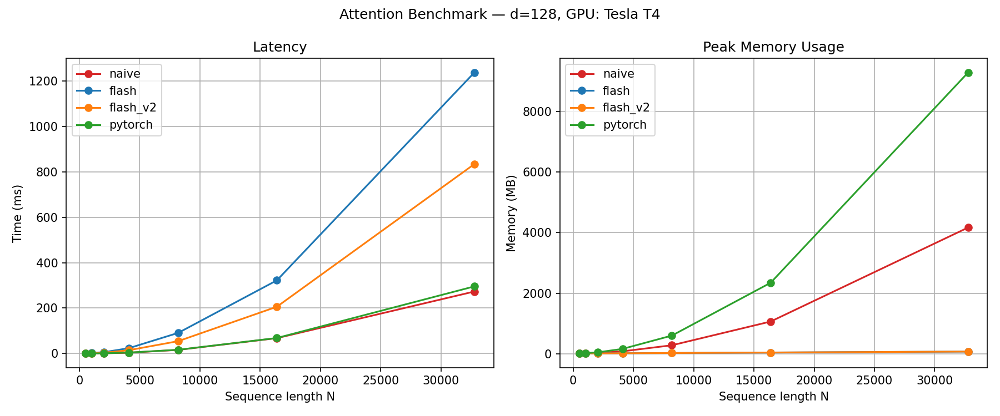
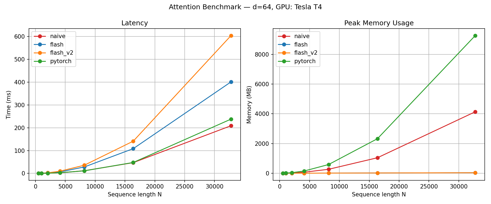

[](https://github.com/jrw96/flash-attn/actions/workflows/ci.yml)

# FlashAttention from Scratch in CUDA

A from-scratch CUDA C implementation of the [FlashAttention](https://arxiv.org/abs/2205.14135) forward pass, built to understand the algorithm's performance characteristics at the hardware level. Includes two kernel variants — a scalar-per-thread implementation (v1) and a warp-cooperative implementation (v2) — benchmarked against a cuBLAS-based baseline and PyTorch's `scaled_dot_product_attention`, with Nsight Compute profiling to explain the results.

**Hardware:** Tesla T4 (sm75) · 15 GB HBM2 · 320 GB/s peak bandwidth · 8.1 TFLOPS FP32 · 65 TFLOPS FP16 (tensor cores)

## Key findings

1. **Memory scaling works as expected.** The flash kernels use O(N) memory vs O(N²) for naive/PyTorch — a 58× reduction at N=32768, d=128. This is FlashAttention's primary contribution.

2. **Latency does not improve over cuBLAS in FP32.** The naive cuBLAS baseline is faster at all tested sequence lengths. The profiling data explains why: at FP32 arithmetic intensity, compute dominates over memory access, and cuBLAS's double-buffered DRAM prefetching hides what memory cost there is. FlashAttention's latency advantage requires the higher compute throughput of FP16 tensor cores to shift the bottleneck toward memory — see [detailed analysis below](#why-flash-is-slower-on-latency).

3. **The v1 → v2 optimisation demonstrates a measurable hardware-level improvement.** SM throughput rises from 10.5% to 72.5% of peak (within 2 points of cuBLAS's 74.4%), driven by a reduction from 219 to 62 registers per thread via warp-cooperative dot products.

## Results




Head dimensions d=64 and d=128 correspond to GPT-2/3-era and current-generation (LLaMA, Mistral) architectures respectively.

### Memory

|      N | flash / flash_v2 | naive (cuBLAS) | PyTorch SDPA | Ratio (naive/flash) |
| -----: | ---------------: | -------------: | -----------: | ------------------: |
|    512 |             9 MB |          10 MB |        11 MB |                1.1× |
|  4,096 |            16 MB |          80 MB |       160 MB |                5.0× |
|  8,192 |            24 MB |         280 MB |       600 MB |               11.7× |
| 32,768 |            72 MB |       4,168 MB |     9,288 MB |           **57.9×** |

Memory scaling is O(N) for flash (bounded by the KV tile size in shared memory) vs O(N²) for naive and PyTorch (which materialise the full attention matrix). PyTorch's higher footprint relative to naive reflects autograd bookkeeping and workspace buffers beyond the N×N matrix itself.

### Latency

**d=64:**

|      N |    naive | flash (v1) |  flash (v2) |  PyTorch |
| -----: | -------: | ---------: | ----------: | -------: |
|    512 |  0.61 ms |    0.72 ms | **0.44 ms** |  0.31 ms |
|  1,024 |  0.42 ms |    0.82 ms |     0.55 ms |  0.33 ms |
|  4,096 |  2.58 ms |    6.40 ms |    10.00 ms |  2.97 ms |
|  8,192 | 12.05 ms |   28.16 ms |    37.89 ms | 12.41 ms |
| 32,768 |   269 ms |     412 ms |      632 ms |   261 ms |

**d=128:**

|      N |    naive | flash (v1) |  flash (v2) |  PyTorch |
| -----: | -------: | ---------: | ----------: | -------: |
|    512 |  0.31 ms |    1.51 ms | **0.45 ms** |  0.23 ms |
|  1,024 |  0.40 ms |    2.50 ms |     0.91 ms |  0.30 ms |
|  4,096 |  4.25 ms |   23.58 ms |    15.35 ms |  4.98 ms |
|  8,192 | 20.11 ms |   92.86 ms |    57.81 ms | 20.00 ms |
| 32,768 |   313 ms |   1,255 ms |      878 ms |   332 ms |

V2 beats v1 consistently at d=128 (1.4-3.4×), where v1's register spilling is most severe. Both flash kernels remain slower than cuBLAS. V2 regresses against v1 at d=64 for large N — the explanation is in the [profiling analysis](#why-v2-regresses-at-d64-for-large-n). The naive baseline matches or slightly beats PyTorch SDPA on latency because it calls cuBLAS directly with raw pointers, bypassing PyTorch's dispatcher, autograd graph construction, and workspace allocation overhead.

### Correctness

All implementations validated against PyTorch SDPA across N ∈ {64, 128, 256, 512, 1024} and d ∈ {64, 128}. Maximum absolute error: 1×10⁻⁶.

<details>
<summary>Full correctness output</summary>

```
naive  N=  64 d=64 | max: 0.000000 | mean: 0.000000 | PASS
flash  N=  64 d=64 | max: 0.000000 | mean: 0.000000 | PASS
flash_v2  N=  64 d=64 | max: 0.000000 | mean: 0.000000 | PASS
naive  N=  64 d=128 | max: 0.000000 | mean: 0.000000 | PASS
flash  N=  64 d=128 | max: 0.000001 | mean: 0.000000 | PASS
flash_v2  N=  64 d=128 | max: 0.000000 | mean: 0.000000 | PASS
naive  N= 128 d=64 | max: 0.000000 | mean: 0.000000 | PASS
flash  N= 128 d=64 | max: 0.000000 | mean: 0.000000 | PASS
flash_v2  N= 128 d=64 | max: 0.000000 | mean: 0.000000 | PASS
naive  N= 128 d=128 | max: 0.000000 | mean: 0.000000 | PASS
flash  N= 128 d=128 | max: 0.000001 | mean: 0.000000 | PASS
flash_v2  N= 128 d=128 | max: 0.000001 | mean: 0.000000 | PASS
naive  N= 256 d=64 | max: 0.000000 | mean: 0.000000 | PASS
flash  N= 256 d=64 | max: 0.000000 | mean: 0.000000 | PASS
flash_v2  N= 256 d=64 | max: 0.000000 | mean: 0.000000 | PASS
naive  N= 256 d=128 | max: 0.000000 | mean: 0.000000 | PASS
flash  N= 256 d=128 | max: 0.000000 | mean: 0.000000 | PASS
flash_v2  N= 256 d=128 | max: 0.000000 | mean: 0.000000 | PASS
naive  N= 512 d=64 | max: 0.000000 | mean: 0.000000 | PASS
flash  N= 512 d=64 | max: 0.000000 | mean: 0.000000 | PASS
flash_v2  N= 512 d=64 | max: 0.000000 | mean: 0.000000 | PASS
naive  N= 512 d=128 | max: 0.000000 | mean: 0.000000 | PASS
flash  N= 512 d=128 | max: 0.000000 | mean: 0.000000 | PASS
flash_v2  N= 512 d=128 | max: 0.000000 | mean: 0.000000 | PASS
naive  N=1024 d=64 | max: 0.000000 | mean: 0.000000 | PASS
flash  N=1024 d=64 | max: 0.000000 | mean: 0.000000 | PASS
flash_v2  N=1024 d=64 | max: 0.000000 | mean: 0.000000 | PASS
naive  N=1024 d=128 | max: 0.000001 | mean: 0.000000 | PASS
flash  N=1024 d=128 | max: 0.000000 | mean: 0.000000 | PASS
flash_v2  N=1024 d=128 | max: 0.000000 | mean: 0.000000 | PASS
```

</details>

## Nsight Compute profiling

Profiled at N=4096, d=64.

| Metric                        | flash (v1) | flash (v2) | cuBLAS SGEMM |
| :---------------------------- | ---------: | ---------: | -----------: |
| Registers per thread          |        219 |         62 |          118 |
| SM throughput (% peak)        |      10.5% |      72.5% |        74.4% |
| L1/shared throughput (% peak) |      84.3% |      74.8% |        85.2% |
| DRAM throughput (% peak)      |      0.07% |      0.02% |        25.2% |

### What the v1 → v2 optimisation fixed

**V1's bottleneck is register spilling.** At 219 registers per thread (T4 limit: 255), the compiler spills registers to local memory routed through L1 cache. This explains v1's profile: 84% L1 throughput but only 10.5% SM throughput. The SMs are stalled on register spill/fill traffic, not doing useful compute.

**V2 distributes the head dimension across 32 warp lanes.** Each thread holds D/32 elements (2 for d=64, 4 for d=128) instead of the full D. Registers drop from 219 to 62, SM throughput rises to 72.5% — a **6.9× improvement** in compute utilisation, landing within 2 percentage points of cuBLAS.

### Why v2 regresses at d=64 for large N

V2 is faster than v1 at d=128 across all sequence lengths but slower at d=64 for N ≥ 4096. The optimisation targets register spilling — at d=64, v1 needs 128 registers for Q/O arrays (within the 255 limit without severe spilling), so the warp shuffle overhead (5 reduction steps × 32 KV rows per tile) adds latency without offsetting a spill that wasn't happening. At d=128, v1 needs 256 registers for Q/O arrays alone — past the hardware limit — so spilling is severe and v2's register reduction dominates.

This regime-dependent behaviour is expected. An optimisation that targets a specific bottleneck should only help when that bottleneck is active.

## Why flash is slower on latency

The FlashAttention paper's central claim is that attention is **memory-bound** and that reducing HBM accesses from O(N²d) to O(N²d²/M) (where M is SRAM size) improves both memory and latency. Our results show the memory improvement but not the latency improvement. The profiling data explains why.

### The naive baseline is not memory-bound

CuBLAS's profile shows 74.4% SM throughput but only 25.2% DRAM throughput. If memory access were the bottleneck, you'd see the inverse — high DRAM throughput with SMs stalled waiting for data. Instead, cuBLAS is **compute-bound**: its double-buffered software pipeline overlaps DRAM loads with tensor operations so effectively that memory latency is almost fully hidden.

At N=4096, d=64, the N×N attention matrix is 64 MB. The T4's 320 GB/s HBM bandwidth can move that in ~0.2 ms — a small fraction of the 2.6 ms total kernel time. The memory fits, the bandwidth is sufficient, and cuBLAS's pipelining hides what cost there is.

### FP32 arithmetic intensity masks the memory advantage

This is the core issue. The T4 delivers 8.1 TFLOPS in FP32 but 65 TFLOPS in FP16 via tensor cores — an 8× difference. In FP32, each FLOP is expensive relative to each byte moved, so the workload is compute-dominated. Eliminating memory accesses (which FlashAttention does) has little impact because memory access wasn't the bottleneck.

In FP16, the equation reverses. Tensor cores make compute 8× cheaper, but HBM bandwidth stays at 320 GB/s. The **arithmetic intensity threshold** — the FLOP-to-byte ratio at which a workload transitions from memory-bound to compute-bound — shifts dramatically. Workloads that were safely compute-bound in FP32 become memory-bound in FP16, and FlashAttention's IO reduction translates directly to latency savings.

The original FlashAttention paper benchmarks exclusively in FP16/BF16 on A100 GPUs (where tensor cores deliver 312 TFLOPS vs 19.5 TFLOPS FP32 — a 16× ratio). This is not incidental to their results; it is a precondition for them.

### What FlashAttention's memory advantage means in practice

Even without a latency win, the O(N) → O(N²) memory gap matters in production:

- **Batch size.** In inference serving, HBM holds model weights, KV caches for all active requests, and activation memory for every layer and head simultaneously. At N=32768 with d=128, naive attention needs 4.1 GB per layer per head just for the attention matrix. FlashAttention needs 72 MB. The difference determines whether you can batch 8 requests or 1 — directly translating memory savings into serving throughput.

- **Sequence length ceiling.** The N×N matrix grows quadratically. At FP32, the T4's 15 GB HBM is exhausted by a single attention matrix at around N ≈ 62,000. Flash has no such ceiling (limited only by the O(N·d) storage for Q, K, V, and O).

- **Multi-head / multi-layer context.** A real transformer runs attention for every head in every layer. With 32 heads and 32 layers, the aggregate memory for attention matrices across the full forward pass multiplies by 1024×.

## Architecture

### Naive baseline (`naive_attn.cu`)

Standard three-step attention using cuBLAS SGEMM:

1. **S = QK^T / √d** — `cublasSgemm` (SGEMM_TN) with scaling folded into alpha
2. **P = softmax(S)** — custom kernel with shared-memory tree reduction
3. **O = PV** — second `cublasSgemm` (SGEMM_NN)

Materialises the full N×N attention matrix. O(N²) memory, but access to cuBLAS's architecture-specific GEMM kernels (`volta_sgemm_128x128_tn`) with double-buffered DRAM prefetching.

### Flash v1 (`flash_attn.cu`)

One thread per query row. Each thread loads its full Q row (D floats) into registers, iterates over KV tiles in shared memory, and maintains online softmax state — running max `m`, normaliser `l`, and unnormalised output accumulator `O`.

```
for each KV tile:
    load K_tile, V_tile into shared memory
    for j in 0..Bc:
        s[j] = dot(q_reg, K_tile[j]) * scale
    m_new = max(m, max(s))
    correction = exp(m - m_new)
    O = O * correction + exp(s - m_new) @ V_tile
    l = l * correction + sum(exp(s - m_new))
    m = m_new
O = O / l
```

O(N) memory. Correct but slow: scalar arithmetic with one thread doing D multiply-adds sequentially, and register spilling at d ≥ 128 (219 registers at d=64, more at d=128).

### Flash v2 (`flash_attn_v2.cu`)

One warp (32 threads) per query row. Three changes:

1. **Warp-parallel dot products.** Each lane holds D/32 elements of Q. Partial dot products are reduced via `__shfl_down_sync` (5 steps), broadcast to all lanes via `__shfl_sync`. Per-thread arithmetic drops from D to D/32 multiply-adds + 6 shuffle operations per KV row.

2. **Per-row online softmax.** Each KV row is processed immediately — score, update m/l, accumulate O — rather than computing all Bc scores first. This eliminates the `float scores[Bc]` register array (32 floats), further reducing register pressure at the cost of more frequent `exp()` evaluations.

3. **Bank-conflict-free shared memory.** Thread k owns head-dimension indices {k, k+32, k+64, ...}. With row-major layout (stride D, a multiple of 32), lane k accesses bank k%32 — all 32 lanes hit distinct banks. Zero conflicts.

```
for each KV tile:
    cooperatively load K_tile, V_tile  (all 1024 threads)
    for j in 0..Bc:
        dot = warp_reduce(q_reg[0..EPT] · K_tile[j][lane_offsets])
        s = broadcast(dot) * scale
        m_new = max(m, s)
        correction = exp(m - m_new)
        O = O * correction + exp(s - m_new) * V_tile[j][lane_offsets]
        l = l * correction + exp(s - m_new)
        m = m_new
O = O / l
```

Same O(N) memory. 62 registers per thread (vs 219), 72.5% SM throughput (vs 10.5%).

## Building

Requires a working CUDA toolkit and a pre-installed PyTorch with CUDA support. `--no-build-isolation` is required because `setup.py` imports `torch.utils.cpp_extension` at build time.

```bash
# Install (builds all three CUDA extensions)
pip install --no-build-isolation .

# With dev dependencies (ruff, pytest, matplotlib)
pip install --no-build-isolation ".[dev]"

# Correctness tests
python tests/test_correctness.py

# Benchmarks (outputs to results/)
python python/benchmark.py
```

## Future work

These are concrete next steps, listed roughly in order of expected impact:

1. **FP16 tensor cores via `nvcuda::wmma`.** The T4 supports `wmma::mma_sync` with 16×16×16 FP16 tiles (65 TFLOPS vs 8.1 TFLOPS FP32). Restructuring the Q·K^T and P·V operations around wmma fragments would provide ~8× compute throughput, shifting the bottleneck toward memory access and enabling FlashAttention's IO reduction to translate into latency savings. FP32 accumulators would be maintained for the online softmax to preserve numerical stability. This is the single change most likely to produce a latency crossover with cuBLAS.

2. **Double-buffered tile loading.** The DRAM throughput gap (0.02% vs cuBLAS's 25.2%) shows that the flash kernels fully expose global memory latency. A second shared memory buffer would allow the next KV tile to be loaded from HBM while the current tile is being computed, overlapping data movement with arithmetic. On the T4 (64 KB shared memory per SM), this doubles shared memory usage to 32 KB for d=64 — still within budget for 2 blocks per SM.

3. **Causal masking.** Autoregressive inference requires upper-triangular masking. Tiles that fall entirely below the diagonal can be skipped, roughly halving total work for causal attention. Tiles that straddle the diagonal require per-element masking within the softmax computation.

4. **Multi-head batched attention.** Extending from (N, d) to (B, H, N, d) tensors with batch and head dimensions parallelised across the grid. In production, the batch and head dimensions provide enough parallelism to saturate the GPU even at small N, which is the common case during autoregressive decoding.

## Useful Reading

- Aleksa Gordić's primer on FlashAttention, [ELI5: FlashAttention](https://gordicaleksa.medium.com/eli5-flash-attention-5c44017022ad)
- And the associated github repository: [](https://github.com/gordicaleksa/pytorch-original-transformer)
- A nice lecture on the CUDA side of things, by Prof. Mike Giles of Oxford University: [FlashAttention: an interesting CUDA application](https://people.maths.ox.ac.uk/gilesm/cuda/lecs/FlashAttention.pdf)

## References

- Dao et al., [FlashAttention: Fast and Memory-Efficient Exact Attention with IO-Awareness](https://arxiv.org/abs/2205.14135) (2022)
- Dao, [FlashAttention-2: Faster Attention with Better Parallelism and Work Partitioning](https://arxiv.org/abs/2307.08691) (2023)
- [Dao-AILab/flash-attention](https://github.com/Dao-AILab/flash-attention) — reference implementation
